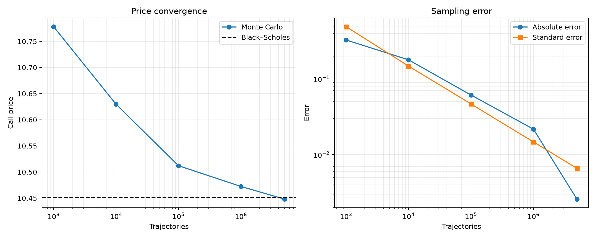
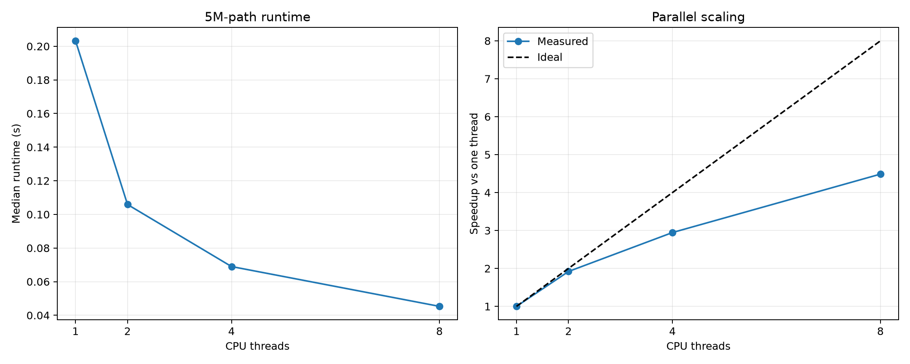
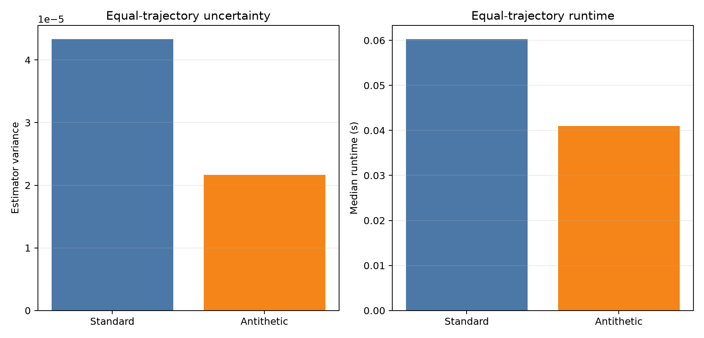
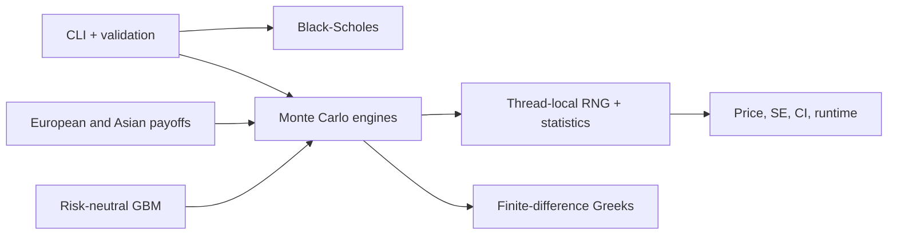

# Monte Carlo Options Pricing Engine

**C++20 | Multithreaded | Monte Carlo | Options | Numerical Methods**

```text
Analytical Black-Scholes price: 10.450584
Monte Carlo estimate:           10.447338
95% confidence interval:        [10.438221, 10.456454]
Paths:                          5000000
Threads:                        8
Runtime:                        0.047305 s
Throughput:                     105.697121 M paths/s
```

This is a small derivatives pricing and risk engine, not a trading system. It
prices European calls and puts, simulates arithmetic Asian calls, and calculates
Delta, Gamma, and Vega. A separate historical GBM tool produces stock-price
scenarios without mixing physical forecasts into risk-neutral pricing.

## Results

These numbers came from a Release build on an Intel Core i9-13900H laptop. The
test case is a one-year at-the-money call with `S = K = 100`, `r = 5%`,
`sigma = 20%`, and seed 42. Full details are in
[`results/final/`](results/final/).

| Experiment | Result |
| --- | ---: |
| 5M-path price | 10.448002 vs 10.450584 Black–Scholes |
| Absolute error / standard error | 0.002582 / 0.006584 |
| Eight-thread throughput | 110.370M paths/s |
| Eight-thread speedup | 4.486x |
| Antithetic variance reduction | 2.002x |
| 1M-path Greek relative errors | 0.055%–0.129% |
| Peak RSS in documented large runs | 4,124 KiB |







## How it fits together



European options use an exact terminal GBM draw. Asian options use a separate
path engine that keeps only the current price and running average. Each worker
owns its random generator and Welford statistics, so there is no lock in the hot
loop and no need to store every payoff or path.

More detail: [architecture](docs/architecture.md) and
[mathematics](docs/mathematics.md).

## Build and test

You need CMake 3.20+ and a C++20 compiler. Catch2 is downloaded on the first
configure if it is not already installed.

```bash
cmake -S . -B build -DCMAKE_BUILD_TYPE=Release
cmake --build build
ctest --test-dir build --output-on-failure
```

The normal build targets Linux and macOS. GitHub Actions builds and tests both.

## Run it

European calls and puts default to analytical and Monte Carlo pricing together:

```bash
./build/mcprice price \
  --type call \
  --spot 100 --strike 100 \
  --rate 0.05 --volatility 0.20 --maturity 1 \
  --paths 5000000 --threads 8 --seed 42 \
  --antithetic
```

Use `--method mc|analytical|both`. Asian calls use Monte Carlo because there is
no analytical implementation:

```bash
./build/mcprice price \
  --type asian-call \
  --spot 100 --strike 100 \
  --rate 0.05 --volatility 0.20 --maturity 1 \
  --paths 1000000 --threads 8 --steps 252 \
  --batch-size 50000 --seed 42 --antithetic
```

Run `./build/mcprice --help` for every option. Bad and non-finite inputs return a
clear error and a nonzero exit code.

## Forecast a price range

See the [stock forecasting walkthrough](docs/forecast-workflow.md) for data
preparation, commands, backtesting, and interpreting results.

Pass a chronological CSV containing ISO `YYYY-MM-DD` dates and an `Adj Close`
column:

```bash
./build/mcprice forecast --csv examples/sample_prices.csv --horizon-days 20
./build/mcprice forecast --csv examples/sample_prices.csv \
  --metadata examples/sample_prices.meta --lookback-days 10 --horizon-days 20
```

For an exported Apple history, replace the path with your file. Use
`--price-column Close` when adjusted prices are unavailable. The command fits a
historical GBM model and reports a mean, median, 95% model interval, and chance
of finishing above the latest close. These are scenarios, not trading signals.
Expected returns are noisy, and the interval is only meaningful after
out-of-sample backtesting.

Use `--volatility-model ewma --ewma-decay 0.94` to weight recent return
deviations more heavily. Sample volatility remains the default.

Drift defaults to its historical estimate. `--drift-model zero` assumes no
expected price growth. `--drift-model shrinkage --drift-shrinkage 0.5` removes
half of the estimate; zero keeps it and one removes it entirely.

Run a rolling, no-lookahead evaluation against a latest-price baseline:

```bash
./build/mcprice backtest \
  --csv examples/sample_prices.csv \
  --lookback-days 10 --horizon-days 3 --step-days 1
```

The report includes point errors, directional accuracy, Brier score,
probability calibration, and 80%/90%/95% interval coverage, width, and proper
interval scores. It compares the selected GBM with unchanged-price,
historical-drift, zero-drift, momentum, and mean-reversion baselines. Direction
scores include Wilson intervals. A deterministic paired bootstrap reports
whether MAE improvement is better, worse, or inconclusive.

## Method

Under risk-neutral Black–Scholes dynamics,

```math
S_T=S_0\exp\left((r-\tfrac12\sigma^2)T+\sigma\sqrt{T}Z\right),
\qquad Z\sim N(0,1).
```

For discounted payoffs `X_i`, the engine reports

```math
\hat V=\frac1n\sum X_i,
\qquad SE=\frac{s}{\sqrt n},
\qquad CI_{95\%}=\hat V\pm1.96SE.
```

Antithetic mode averages the payoffs from `Z` and `-Z` and treats that pair as
one independent observation. Asian monitoring uses `jT/M`, `j = 1,...,M`, so it
excludes today's spot and includes maturity. Greeks use central differences with
common random numbers, with forward Vega differences near zero volatility.
Vega is reported per one volatility percentage point.

## Reproduce the plots

For multi-stock accuracy testing with a frozen validation/holdout split, see
the [forecast benchmark guide](docs/forecast-benchmark.md).

```bash
python3 -m venv .venv
.venv/bin/python -m pip install -r python/requirements.txt
./build/mc_final_benchmarks results/final
.venv/bin/python python/plot_final_benchmarks.py
```

The Python script checks the CSV calculations before plotting them. An
independent NumPy/SciPy check is available in `python/validate_black_scholes.py`.

## Assumptions and limits

- Zero dividends, flat continuous rates, constant volatility, and risk-neutral
  geometric Brownian motion.
- European calls and puts plus one discretely monitored arithmetic Asian call.
- No early exercise, stochastic volatility, jumps, calibration, portfolios, or
  execution.
- Confidence intervals cover Monte Carlo sampling error, not model risk.
- Forecast ranges assume future log returns resemble the supplied history.
- EWMA changes forecast uncertainty only; it does not change pricing volatility.
- Drift shrinkage is a transparent sensitivity control, not a fitted signal.
- Historical forecasting remains separate from risk-neutral option valuation.
- Greeks also contain finite-difference bump error.
- Fixed configurations reproduce on the same implementation and toolchain.
  Different thread counts or standard libraries may produce different random
  streams but should remain statistically consistent.
- Benchmarks describe one laptop without CPU pinning or thermal control.

Likely next steps are thread-count-independent streams, Greek confidence
intervals, more variance-reduction methods, and broader CI coverage.

## Layout

```text
include/mc/  Public C++ interfaces
src/         Engine and CLI implementation
tests/       Catch2 tests
benchmarks/  C++ experiments
python/      Validation and plots
results/     Raw data and measured environments
docs/        Architecture and mathematics
```
