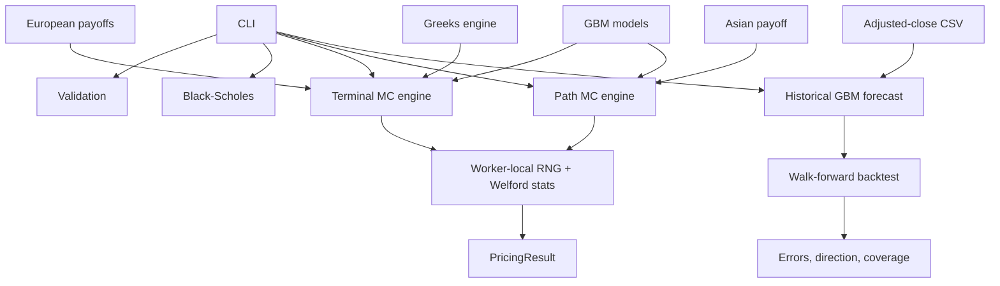

# Architecture

The code separates payoffs, models, simulation, statistics, and presentation.
That keeps the math testable and avoids making European and path-dependent
options share an awkward interface.

## Pricing flow

For European options, `BlackScholesModel` precomputes the terminal drift,
diffusion, and discount factor. The engine divides observations among workers.
Each worker owns its RNG and running statistics, then the calling thread joins
and merges the results in worker order.

The Asian engine advances one price at a time and keeps a running sum. It never
stores an `N × M` path matrix. Antithetic mode keeps a second price driven by
`-Z`; the two payoffs form one statistical observation.

`PricingResult` contains the price, variance, standard error, 95% confidence
interval, path and observation counts, runtime, and throughput.

## Threads and reproducibility

There is no shared RNG or hot-loop lock. Worker zero uses the configured seed;
other workers receive deterministically mixed seeds. The same full
configuration reproduces on the same toolchain.

Changing thread count changes work partitioning and random streams.
`std::normal_distribution` can also differ across standard libraries, so results
across thread counts and platforms are statistically consistent rather than
bit-identical.

Custom terminal payoffs may use `Instrument`, but their `payoff()` method must
be safe for concurrent calls. Path-dependent products should get a focused path
interface instead of being forced into the terminal abstraction.

## Memory and errors

Welford summaries are mergeable, so workers do not retain payoff arrays.
Batching limits observations processed between merges without restarting the
RNG. Memory grows with worker state, not path count.

Public entry points reject non-finite values, invalid domains, zero paths or
threads, zero Asian steps, and odd antithetic path counts. Worker exceptions are
captured and rethrown after every thread is joined.

## Forecasting boundary

Forecasting reads chronological adjusted closes and estimates physical-measure
log-return drift and volatility. It returns a price distribution, not an option
value. This module does not feed the risk-neutral pricing engines.

Forecast volatility can use the full-window sample estimate or normalized EWMA
weights. Both retain the same historical mean-return estimate. This choice is
confined to forecasting and does not alter option-pricing market data.

Forecast drift can retain the historical GBM estimate, set expected price
growth to zero, or shrink it toward zero by a configured fraction. Historical
drift remains the default.

The walk-forward evaluator repeatedly fits the model through a forecast origin
and scores only later prices. It compares the expected-price forecast with
latest-price, historical- and zero-drift GBM, log-price momentum, and trailing
mean-reversion baselines. The configurable step controls whether targets
overlap.
